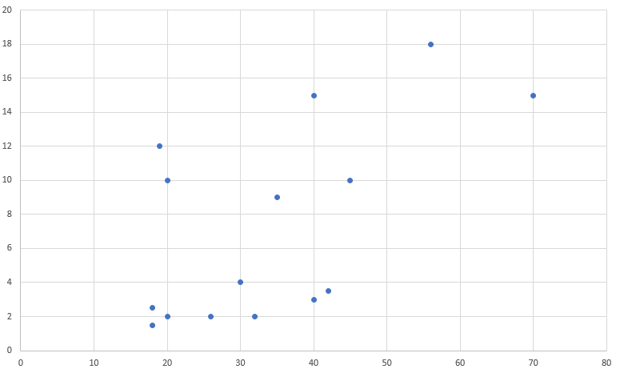

Bir önceki yazıda bir veri dizisinin ne kadar tahmin edilemez şekilde dağıldığını matematik ile açıklayan _entropi_ kavramına bakmıştık. Bu yazıda ise iki veri dizisi içindeki değerlerin bir birileri ile olan ilişkilerine bakmak için _korelasyon_ kavramına bakacağız ve en temel korelasyon hesaplamalarından birisi olan _Pearson_ yöntemini C# ile örneklendireceğiz.

### Korelasyon hakkında
_Korelasyon_ iki dizi arasındaki doğrusal ilişkinin yön ve kuvvet bakımından incelenmesidir. Bu konu hakkında en sık verilen örneklerden birisi, trafik sigortalarına ilişkin verilerin incelenmesinde akraba olan kişilerin akraba olmayanlara göre daha fazla kaza yaptığının ortaya çıkmasıdır. Burada hemen şu söz patlatılır, "korelasyon bir neden sonuç açıklaması yapmaz" çünkü bu senaryodan "akrabalar birbirileri ile daha çok kaza yapar" sonucu çıkartamayız. Biz de neden sonuç aramadan ilişkileri nasıl bulacağımıza bakacağız. Daha basit örneklerle devam edelim, elimizde müşteri bilgileri olsun. Bu müşteriler için hem yaş bilgisi hem de doğum tarihi bilgisi alınmış olsun. Bu durumda bu iki niteliği "biri artarken, diğeri de artar" şeklinde düşünebiliriz. Ve biri diğerinin yerine kolaylıkla geçebileceği için bunlardan birisini gereksiz kabul edebiliriz. Bu tip deterministik (_yaş bilgisi için hangi niteliğe baktığımın hiç bir önemi yok_) ilişkilerde yön aynı ve kuvvet yüksek olacaktır.

Farklı bir ilişki türüne bakalım. Bir önceki örnek aynı niteliğin iki farklı anlatımıydı. Bir de 'eğitim durumu' ve 'ortalama gelir' gibi iki niteliği düşünelim. Arada bozan değerler olsa da genel olarak yine doğrusal bir ilişkinin görüleceğini tahmin edebilirsiniz. 

Fakat her zaman bu ilişki veriye bakıldığında kolaylıkla görünmez. Bu ilişkiyi de varsa bulmak isteriz. Bunun ilk amacı klasik istatistik bakış açısıyla veriden bilgi edinmektir. Bir grup müşterinin alışveriş miktarları ile belirli kampanya türleri ile ilişki olduğunu veya olmadığını fark etmek buna örnek olacaktır. Bir diğer amaç ise bu aralar popüler olan makine öğrenmesinde nitelik seçimi olacaktır. Eğer bir biri ile doğrusal ilişkisi kuvvetli olan iki veya daha fazla niteliği öğrenme aşamasında kullanırsanız; sonuçlar bu ilişkinin temel sebebine göre ağırlıklı olarak çıkacaktır. Biraz açıklamaya çalışayım; ilk örneğimize uygun olarak düşünelim; niteliklerimiz `doğum yılı, yaş, cinsiyet, gelir, medeni durum` şeklinde olsun. Bu nitelikler ile yapacağımız öğrenme bir çok sınıflandırıcı için yaşa göre ağırlıklı oluşacaktır. Bu iki nitelikten birisini kaldırdığımızda ise `yaş, cinsiyet, gelir, medeni durum`şeklinde daha dengeli bir dağılım olacaktır. Fakat burada şunu söylemek mümkündür, "_gelir yaş ile doğrusal bir ilişkiye sahip olduğunda bunlardan birisini çıkartmak  gerekir mi?_" bu senaryoda eğer ilişki çok güçlü çıkmıyorsa elemek mantıklı olmayacaktır. Çünkü 'gelir' gerçekten 'yaş'la ilişkili olsa da aslında bize verilmeyen 'meslek','eğitim durumu' gibi bir çok nitelikle de ilişkilidir ve aslında biz 'gelir'i kullanarak bunları da kullanmış oluyoruz. Yine korelasyon çok yüksek olmadığında, "bilgi kazancı" gibi konular devreye giriyor ama yazıdan çıkmayalım :)

Elimizde aşağıdaki gibi iki dizi olsun :

```csharp
var yaslar = new[] { 18, 20, 18, 26, 35, 40, 56, 70, 20, 40, 42, 30, 32, 19, 45 };
var aylıkgelir = new[] { 1.5, 2, 2.5, 2, 9, 15, 18, 15, 10, 3, 3.5, 4, 2, 12, 10 };
```

Bunu Excel yardımıyla grafiğe dökelim:



Çok bariz bir çizgi olmasa da sağa doğru ilerlediğinizde tahmininiz noktaların daha yüksekte olacağından yana olacaktır. Bu yönü bulma işine ise _kovaryans_ adı veriliyor ve formülü şu şekilde:

$$\sum_{i=1}^N{\frac{(x_i - \bar{x})(y_i - \bar{y})}{N-1}}$$


Formül her iki dizideki elemanları sırayla alıp, her iki dizi için sıradaki elemandan ilgili dizinin ortalamasını çıkartıp diğer dizi için olan sonuca çarpıp toplam satır sayısını bölüyor. Eğer formülü varyans formülü ile karşılaştırırsanız (x-μ)^2^ kısımının  (x-x̅) * (x-x̅) şeklinde değil de  (x-x̅) * (y-y̅) yazılarak birleştirildiğini göreceksiniz. Yani her iki dizinin elemanlarının ortalamadan bir birilerine göre nasıl uzaklaştıklarına bakılmaktadır.

### Bunları koda dökelim

Sıra geldi bütün bunları C# kullanarak koda dökmeye. Bu yazılarda amacım ödevlere yönelik cevaplar olmadığından ve LINQ kullanmayı seven bir insan olarak bu sonucu en kısa yoldan tatminkar performans seviyesinde elde etmeyi örneklendireceğim. Kovaryans ile başlayalım, şöyle bir fonksiyon işimi görecektir:


```csharp
static double Kovaryans(IList<double> dizi1, IList<double> dizi2)
{
	if (dizi1.Count != dizi2.Count) { throw new Exception("Dizi boyutları eşit olmalıdır."); }
	var adet = dizi1.Count - 1;
	var dizi1Ortalama = dizi1.Average();
	var dizi2Ortalama = dizi2.Average();
	return dizi1.Zip(dizi2, (x, y) => (x - dizi1Ortalama) * (y - dizi2Ortalama) / adet).Sum();
}
```

Kovaryans hesaplayabilmek için öncelikle dizilerin eşit sayıda elemana sahip olmaları gerekiyor. Fonksiyonumuz bu kontrolle başlıyor. Daha sonraki üç değişkeni doğrudan linq içerisinde kullanabilirdim fakat tekrar,tekrar hesaplanmamaları için dışarıda tanımladım. Zip methodu iki dizinin elemanlarını sırayla bir fonksiyona veriyor. Yani (x,y) sırasıyla (18,1.5), (20,2) gibi tek tek methoduma gelecek. Methodun içinde formüldeki gibi her bir x ve y den ortalamalarını çıkartıp eleman sayısının bir eksiğine bölüyoruz ve sonuç kümesine ekliyoruz. Elimizde artık bir double dizisi var. En son işlem olarak bu double dizisindeki elemanları topluyoruz ve sonucu dönüyoruz.

Örnek sayılarımız için bu methodu çalıştırdığımızda sonuç `~53` çıkacaktır. Bu da pozitif olduğu için ilişkinin yönünün aynı yöne doğru olduğunu söyleyebiliriz.

İlişkinin gücü için kullanacağımız formül ise : 
$$\frac{n\sum({x_i}*{y_i}) - \sum{x_i}*\sum{y_i}}{\sqrt{n\sum{{x_i^2}}-(\sum{x_i})^2} *\sqrt{n\sum{{y_i^2}}-(\sum{y_i})^2} }$$

Formül karışık gibi gözüküyor, aslında formülün temel hali şu şekilde :

$$\frac{kovaryans(x,y)}{S_x * S_y} $$

Bölme işleminin üst kısımında her iki diziden elemanları sırayla alarak bir varyasyon hesabı yapmıştık. Hatırlayacağınız üzere varyansın karekökü standart sapmayı vermektedir. Kovaryansda olduğuna benzer mantıkla bu sefer her iki dizinin standart sapmalarını bir biriyle çarpıyoruz. 

Hala karışık geliyorsa yaptığımız işe bir de C# tarafından bakın. Daha anlaşılır olacaktır.

```csharp
static double Pearson(IList<double> dizi1, IList<double> dizi2)
{
    double xtoplam = 0;
    double ytoplam = 0;

    double xkaretoplam = 0;
    double ykaretoplam = 0;

    double xycarpimlartoplami = 0;
    double elemanSayisi = dizi1.Count;

    for (var i = 0; i < elemanSayisi; i++)
    {
        xycarpimlartoplami += dizi1[i] * dizi2[i];
        xtoplam += dizi1[i];
        ytoplam += dizi2[i];
        xkaretoplam += Math.Pow(dizi1[i], 2);
        ykaretoplam += Math.Pow(dizi2[i], 2);
    }

    return (elemanSayisi * xycarpimlartoplami - xtoplam * ytoplam)
           /
           Math.Sqrt((elemanSayisi * xkaretoplam - Math.Pow(xtoplam, 2)) *
                     (elemanSayisi * ykaretoplam - Math.Pow(ytoplam, 2)));
}
```

 Formülü elimizdeki sayılara uyguladığımızda sonuç `~0.6` çıkacaktır. Bu da ilişkinin ortanın üzerinde bir güçte olduğunu gösterir. Bu konuda genellikle `0.66` nın üzeri güçlü olarak kabul edilmektedir.


### Bitirirken

Pearson yöntemini genellikle sayısal ifadelerde kullanıyoruz. Fakat nitelikler her zaman sayısal olmak zorunda değiller. Bu durumda **_Spearman , Phi_** gibi gibi yöntemlere başvurmak gerekiyor. Bunlarada zamanla değinmek üzere... 
