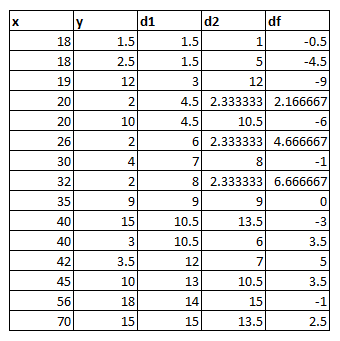

Önceki konularda [pearson](http://cihanyakar.com/korelasyon1pearson) yöntemini anlatmıştım. Pearson yöntemi ölçümlerin hatasız yapıldığı senaryolarda oldukça iyi sonuçlar verirken, yoruma bağlı veya ölçüm hatalarının olabildiği durumlarda başarımı düşmektedir. Spearman yöntemi ise değerler -ki bu değerlerde her zaman sağlanabiliyor- ile değil sıralamalar ile ilgilenerek ilişkiyi bulmaya çalışır. 

Sadece sıralama olarak düşünecek olursak bir mağazanın iki farklı alışveriş merkezinde aylara göre diğer mağazalara göre olan sıralamasının karşılaştırılması düşünülebilir. Veya iki şehrin sıcaklıklarının günlere göre dağılması düşünülebilir. Spearman yöntemi sıralamaya göre çalıştığı için küçük sapmalara karşı daha fazla tolerasyon göstermektedir. Sıcaklık örneğinde olduğu gibi bölgesel küçük değişikliklerden dolayı ölçümler bir kaç derece oynayabilir. Fakat bu oynamalar genel sıralamayı büyük ölçüde değiştirmeyecektir. Yine farklı şehirlerde ölçümlerin birebir aynı termometre ile yapılmadığını düşünecek olursak duyarlılık farklılıkları olacaktır. 

Bir önceki örneğimizde şöyle bir verimiz vardı:

```csharp
var yaslar = new[] { 18, 20, 18, 26, 35, 40, 56, 70, 20, 40, 42, 30, 32, 19, 45 };
var aylıkgelir = new[] { 1.5, 2, 2.5, 2, 9, 15, 18, 15, 10, 3, 3.5, 4, 2, 12, 10 };
```
Bu sayılar için daha önce pearson yöntemi ile hesaplama yapmıştık ve 0.6 değerini bulmuştuk. Karşılaştırma yapabilmek adına aynı sayılarla devam edeceğim.

Öncelikle tabiki formüle ihtiyacımız olacak :

$$r_s =1- \frac{6(\sum{d^2})}{n(n^{2}-1)}$$

Bu formülü açıklayıcı şekilde yazmak gerekirse : 

$$r_s =1- \frac{6 * (\text{sıra farklarının karelerinin toplamı})}{\text{gözlem sayısı }(\text{gözlem sayısı }^{2}-1)}$$

> Neden 6 ile çarpıyoruz diye merak ediyorsanız :) amaç çıkan katsayı değerinin 1 ile -1 arasında olmasını sağlamak. Aksi durumda bir birine ters orantılı ilerleyen dizilerde katsayı hatalı olacaktır.

### Kodlar Gelsin

Sıra geldi bu formülü C# ile yazmaya:

```csharp
public static double Spearman(ICollection<double> seri1, ICollection<double> seri2)
{
    var adet = seri1.Count;
    var siraliSeri1 = seri1.OrderBy(s => s).ToList();
    var siraliSeri2 = seri2.OrderBy(s => s).ToList();

    var siralarFarkiKaresiToplami
        = seri1.Zip(seri2,
                    (x, y) =>
                        Math.Pow(
                                 siraliSeri1.IndexOf(x)
                                 + (siraliSeri1.Count(s => s == x) > 1
                                        ? 1D / siraliSeri1.Count(s => s == x) + 1
                                        : 1)
                                 - (siraliSeri2.IndexOf(y)
                                    + (siraliSeri2.Count(s => s == y) > 1
                                           ? 1D / siraliSeri2.Count(s => s == y) + 1
                                           : 1))
                                 , 2))
               .Sum();

    return 1 - 6D * siralarFarkiKaresiToplami
           / (adet * (Math.Pow(adet, 2) - 1));
}
```

Bu kodda neler yaptım? Öncelikle parametre olarak verilecek verileri sıralama (ordinal) şeklinde gelmesini şart koşmamak adına parametreleri double koleksiyonları olarak ayarladım. Böyle olunca bunları sıralama düzenine sokmak gerekti (_zaten sıralama düzeninde gelirlerse de sorunsuz çalışacaktır_). Her iki dizinin sıralanmış kopyalarını çıkartarak başladım. Daha sonra formüldeki sıralar farkını hesaplayacak LINQ fonksiyonunu hazırladım. Burada temel olarak şunu yapıyoruz. Değerler bakımından birinci olan elemanın karşılığı eleman kendi dizisinde kaçıncı ise çıkartıyoruz. Örneğin, 56 yaş yaşlar içinde sırası `14`; 56 yaşın harcaması ise 18bin onun da kendi içinde sırası `15` bu ikisini bir birinden çıkarttığımızda `-1 ` değerini elde ediyoruz. Örneğin tüm satırlar için yaptığımız işi bir tabloya dökmek istersek :



Tabloyu biraz incelerseniz, eğer bir sırayı birden fazla değer karşılıyor ise sırayı ` 1D / s1.Count(s => s == x) + 1` şeklinde yani `1 / (_aynı sıradaki eleman sayısı_) + 1` olarak buluyoruz. Aksi durumda Spearman  methodu düzgün sonuç vermeyecektir.

Daha sonra formüldeki yapının aynısını uygulayarak sonucu dönüyoruz. Formülü bu sayılar ile çalıştırdığımızda `~0.56` sayısını elde ediyoruz bu da Pearson'a oldukça yakın bir değer. Fakat kazanç tablosuna zengin bir iş adamı girmiş olsun. Son sıradaki 45 yaşındaki kişi 10bin yerine 100bin kazanıyor olsun. Bu durumda bir kişi yüzünden sonuçlar `Pearson : ~0.32 Spearman : ~0.61` şeklinde değişecektir. Veri içindeki sapan bir değer  Pearson yöntemini çok fazla etkilerken, Spearman yönteminde etkilenme oldukça az olmuştur. 
