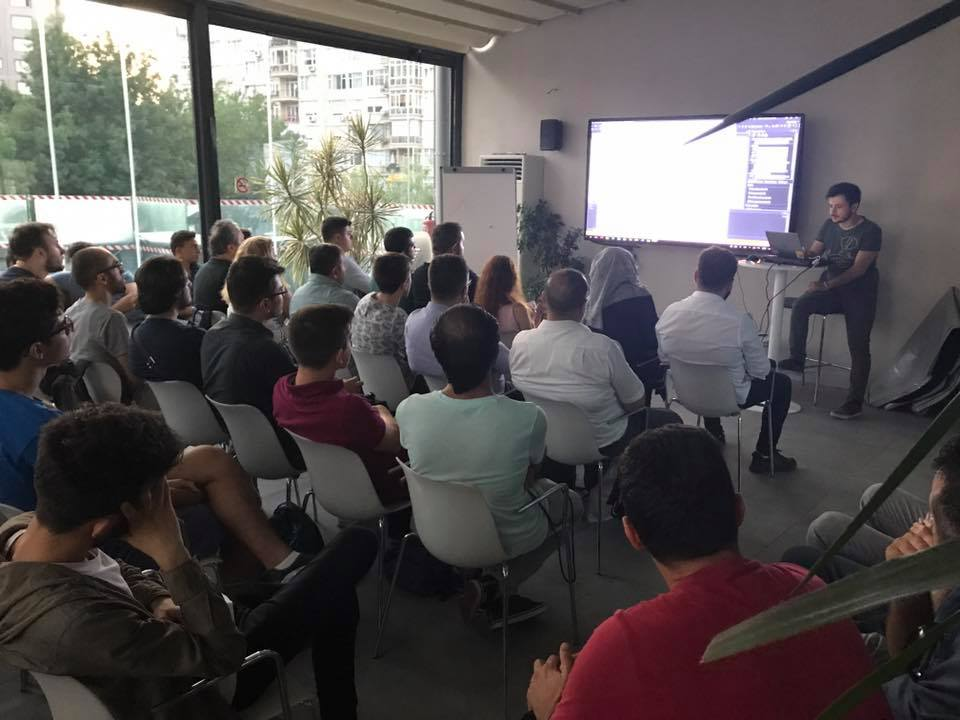

XamarinTR olarak düzenli yapmaya çalıştığımız buluşmayı bu ay 24 Temmuz'da Microsoft Türkiye'de gerçekleştirdik. 

Akşamın en merak edilen konusu [Emrah](https://emrahcapar.com/)'daydı. Kendisi _Xamarin ile SignalR nasıl kullanılır_ uzun uzun anlattı. Arkasından ben bir arayüz nesnesinin farklı platformlarda farklı görünmesini/davranmasını sağlayan _Effects_ konusundan bahsettim. Kapanışı ise [Yiğit](http://ozaksut.com/)  _Xamarin  Form üzerinde Traditional katmanlarla çalışma_ konusu ile bitirdi.

