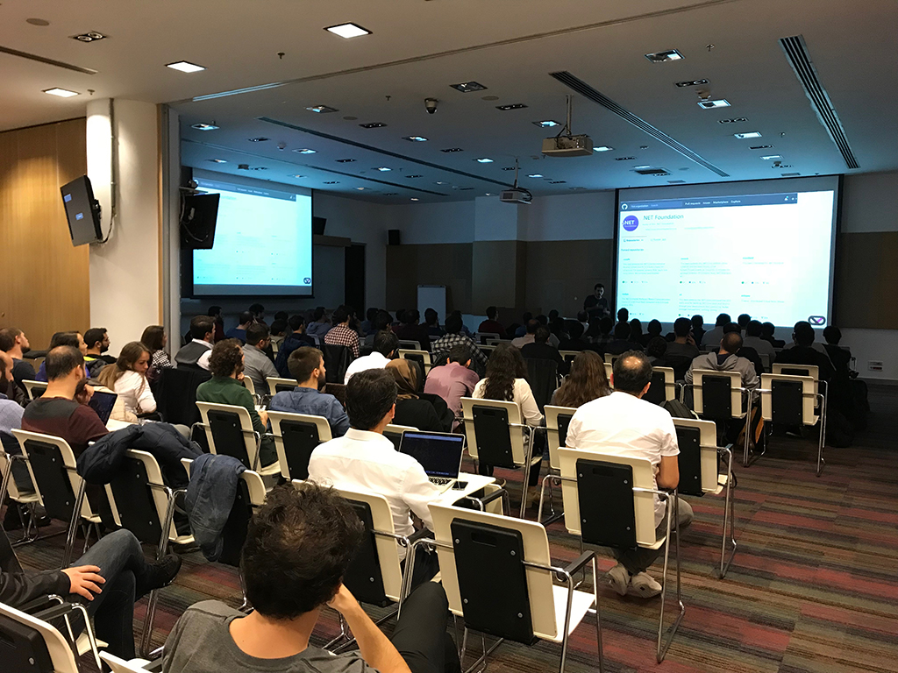
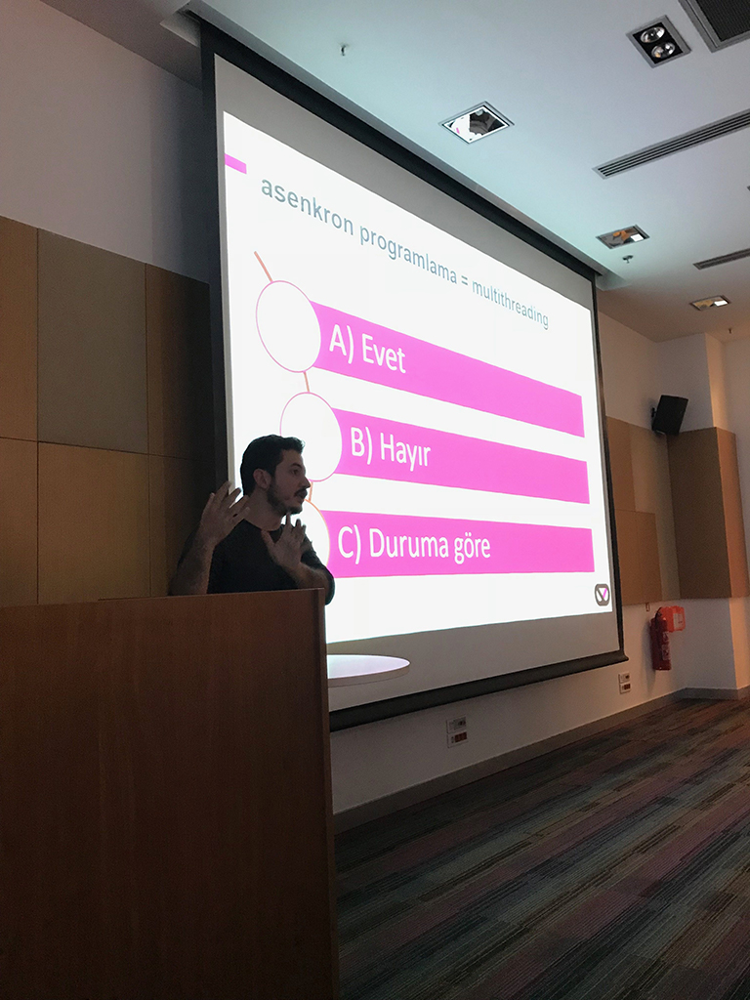

Xamarin Türkiye olarak düzenli yapmaya çalıştığımız buluşmayı  [Yiğit Özaksüt](http://ozaksut.com/), [Erhan Ballıeker](https://twitter.com/ErhanBallieker) ve [Özgür Kaplan](https://twitter.com/Ozgur_Kaplan)  ile birlikte bu ay 25 Ekim'de herzaman ki buluşma yerimiz olan Microsoft Türkiye'de gerçekleştirdik. 

Bu ay yine konu olarak C#'ı seçtim ve yanlış bilinen doğrular hakkında konuştum. Bu sunumdaki maddeleri daha detaylı olarak bloga eklemeye çalışacağım.

Katılan herkese çok teşekkürler.

(Etkliğin Xamarin Türkiye Adresi)[http://www.xamarinturkiye.com/meetup-net-core-ve-xamarin-dependency-injection-xamarin-resilient-network-services/]
