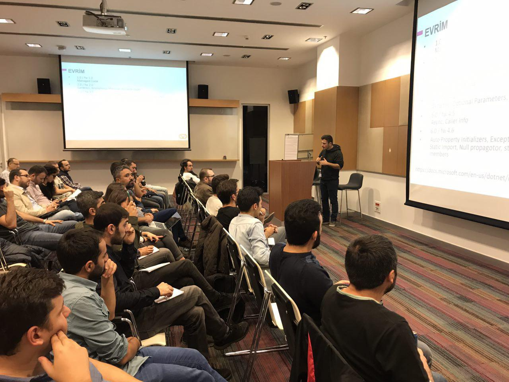
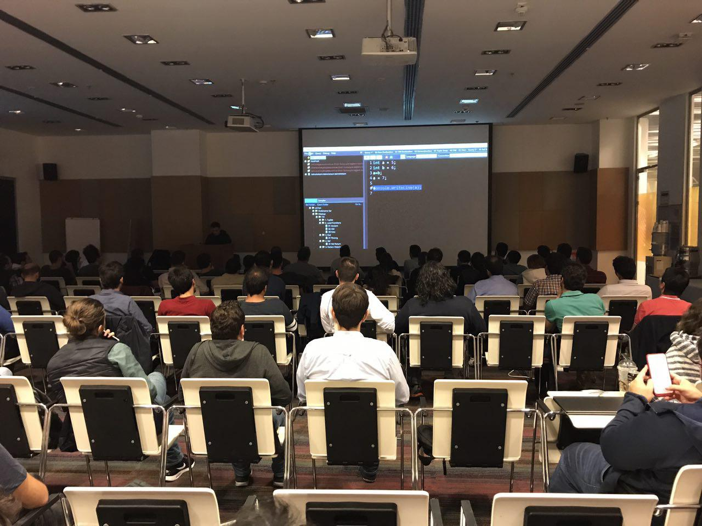

XamarinTR olarak düzenli yapmaya çalıştığımız buluşmayı  [Yiğit Özaksüt](http://ozaksut.com/) ve Erhan Ballıeker ile birlikte bu ay 29 Eylül'de herzaman ki buluşma yerimiz olan Microsoft Türkiye'de gerçekleştirdik. 

Ben bu konuşmada Xamarin özelinden çıkarak bir C# sunumu yaptım ve C# 7 ile gelen özellikleri daha önce gelen özellikler karşılaştırarak anlattım. Bu konuşmanın makalesini ayrıca blogda paylaşacağım. Konu içerisinde Linqpad ile yaptığım çalışmaları : [https://github.com/cihanyakar/c-7](https://github.com/cihanyakar/c-7)  adresinde bulabilirsiniz. Bu dosyalar için illaki Linqpad yüklemenize gerek yok. Dosyalar düz metin dosyaları olduğu için kod kısmını kopyalayıp Visual Studio veya başka hangi geliştirme ortamını kullanıyorsanız orada tecrübe edebilirsiniz. 

Bu buluşmada Microsoft bize efsane ikramlar sundu. Ulaşım konusunda yaşadığım bir sıkıntıdan dolayı akşamın sonuna kadar kalamadım.

Katılan herkese çok teşekkürler.

