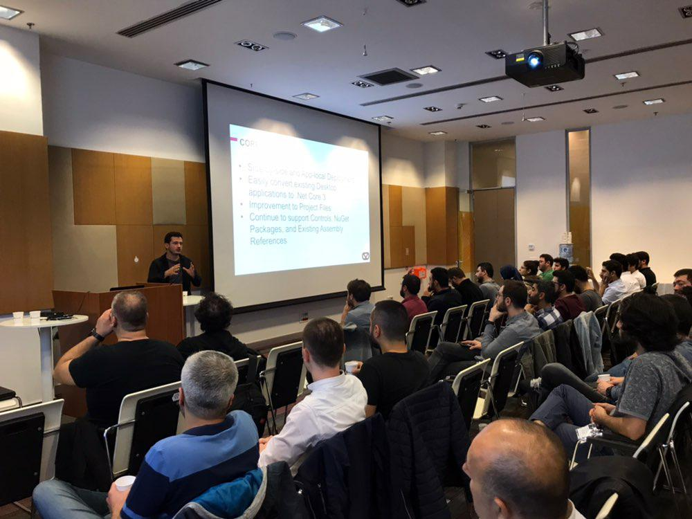
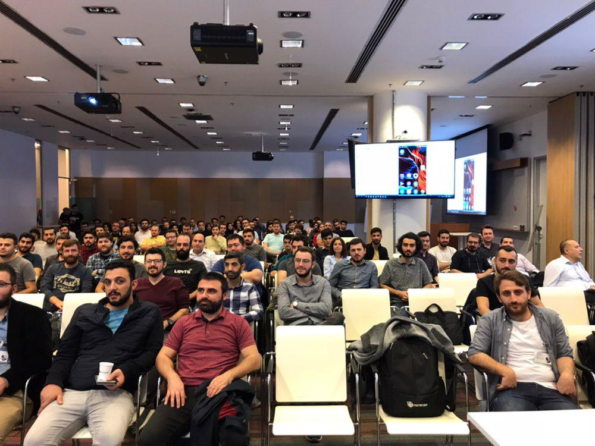
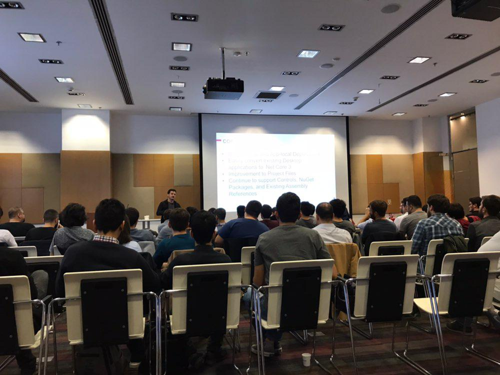

20 Ekim'de Yiğit Özaksüt ve Erhan Ballıeker ile birlikte güzel bir etkinlik gerçekleştirdik. Benim konum .net core 3.0 ve C# 8.0 ile gelmesi planlanan özellikler üzerineydi. Katılan herkese ve Microsoft'a teşekkür ederim. Etkinlikteki sunumumu yazının sonunda bulabilirsiniz. 

<iframe src="//www.slideshare.net/slideshow/embed_code/key/kZTLKg49Ngxaig" width="595" height="485" frameborder="0" marginwidth="0" marginheight="0" scrolling="no" style="border:1px solid #CCC; border-width:1px; margin-bottom:5px; max-width: 100%;" allowfullscreen> </iframe> 
 <strong> <a href="//www.slideshare.net/CihanYakar1/net-core-30-ve-c-80" title=".net Core 3.0 ve C# 8.0" target="_blank">.net Core 3.0 ve C# 8.0</a> </strong> from <strong><a href="https://www.slideshare.net/CihanYakar1" target="_blank">Cihan Yakar</a></strong> 

