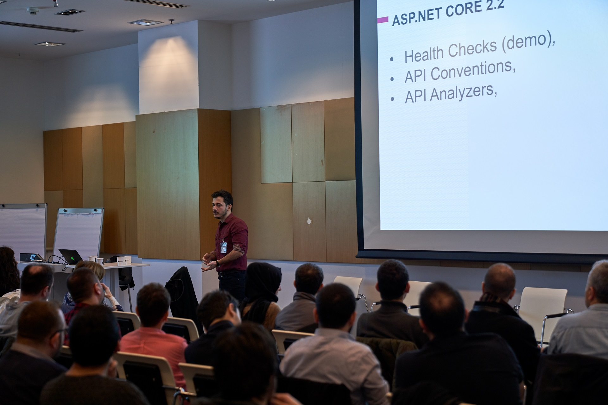
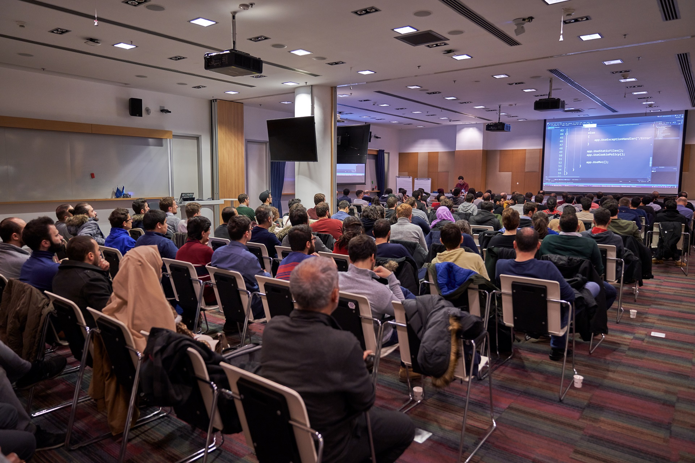
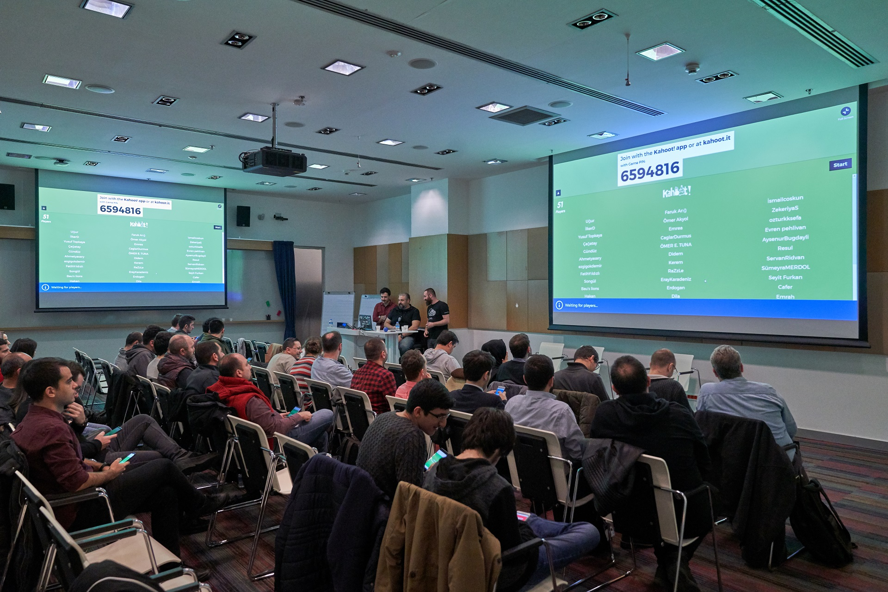

[Teknolot](http://www.teknolot.com) olarak 29 Aralık'ta [Daron Yondem](http://daron.yondem.com), [Yiğit Özaksüt](https://ozaksut.com/) ve Bilgin Biltekin ile beraber Microsoft'un düzenlediği Connect etkinliğinin İstanbul ayağını Microsoft İstanbul'da  düzenledik. Konularımızda orijinal etkinlik konularına sadık kalarak yenilikleri tanıttık. Şahsi fikrim oldukça eğlenceli ve bir şeyler öğreten bir etkinlik olduğu yönünde. Etkinliğin sonunda bir yarışmamız oldu. Açıkçası ben daha önce hiç kahoot deneyimlemediğim için soruları hızlı bir şekilde hazırlayıp geçtim, bu da katılımcıları zorladı. Bir sonraki etkinliğimizde yarışıma yaparsak en kolay soruları ben soracağım :) Sorular ve açıklamalı cevaplarını aşağıya yazdım. Soruların altında fotoğrafları, fotoğrafların altında ise slaytları bulabilirsiniz.

Etkinlik yılın son günlerine rastladığı halde beklediğimizin üzerinde katılım gerçekleşti. Katılan herkese teşekkür ederim. 

## Sorular

 Aşağıdakilerden hangisi ASP.NET Core 2.2 ile yeni gelmemektedir?
​        :x: Health Checks
​        :x: API Conventions
​        :x: API Analyzers
​        :white_check_mark: API Explorer

> İlk üç özellik .net core 2.2 ile gelmektedir. API Explorer ise daha önceki sürümlerde eklenmiştir.

Aşağıdaki bağımlılıklardan hangisi ASP.NET Core 3.0 da *artık* olmayacaktır?
​        :white_check_mark: Json.NET
​        :x: HtmlAgilityPack
​        :x: Dapper
​        :x: SSH.NET

> Json.net 3.0 ile birlikte varsayılan dönüştürücü olmayacaktır.

.net Core 3.0 ile WPF hangi işletim sistemlerinde çalışacaktır?
​        :x: Linux, MacOS, Windows
​        :x: Windows, Linux
​        :x: Windows, MacOS
​       :white_check_mark: Windows

> WPF ve Winforms sadece Windows üzerinde çalışmaya devam edecekler. Bunların Linux veya başka bir işletim sistemine "resmi" olarak port edilmesi gündemde değil.

ASP.net Core 3.0 ile ilgili hangi ifade doğrudur?
​        :white_check_mark: Sadece .net core ile çalışacak
​        :x: Sade .net Framework ile çalışacak
​        :x: Her ikisi ile birlikte çalışacak
​        :x: Tek başına çalışabilecek

> Etkinlikte şarkının sözlerini unuttuğum kısma denk gelen soru oldu bu. asp.net core'un mevcut sürümleri alt katmanda .net ve .net core ile birlikte çalışabilmektedir. .net core 3.0 ile birlikte yalnızca .net core ile çalışması gündemdedir.

Visual Studio 2019 hangi programlama dilini kutudan çıktığı haliyle desteklemez?
​        :x: C#
​        :x: Typescript
​       :white_check_mark: Ruby
​        :x: Python

> Ruby desteği varsayılan olarak gelmemektedir.

Visual Studio 2019 için hangi dil için satır içi destek gelmektedir?
​        :x: SQL
​        :white_check_mark: Regex
​        :x: ESQL
​        :x: JSON

> Bu soru yarışmada hatalı gözüktüğü halde çok yüksek doğruluk aldı, katılanları tebrik ediyorum. VS 2019 da Regex yazarken bir extension olmaksızın syntax renklendirmesi olacak. Diğer diller içinde ilerleyen süreçte benzer geliştirme olacaktır.

Visual Studio 2019 dan hangi özellikler standart kurulumdan kaldırılmamıştır?
​        :x: Uzak FTP konumundan Web Site projesi açma
​        :x: The Application Insights Trends
​        :x: Windows Phone emulatorleri
​        :white_check_mark: Visual Studio Live Share

> Bu soruda oldukça fazla sayıda  bilindi. Ama okunmasının ve anlamasının gerçekten saniyelerle yarışılan bir ortam için zor olduğunu kabul ediyorum. Sunum sırasında demo yaptığımız Live Share özelliği kurulduğu anda karşımızda olacaktır. Diğer özellikler ise standart kurulumdan çıkartılmıştır.

Visual 2019 en düşük hangi Windows işletim sisteminde çalışabilir?
​        :x: Windows 10
​        :x: Windows 8.1 
​        :x: Windows 8
​        :white_check_mark: Windows 7 SP1

> Bunu üzerine basarak söylemiştim. VS 2019 Windows 7 den itibaren çalışacak. Fakat açık kapı bırakmakta fayda var Release sürümü geldiğinde fikirler değişebilir.

## Fotoğraflar

## Slaytlar

