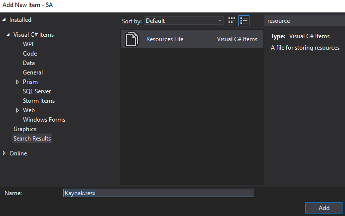

Muhtemelen bildiğiniz ama belki de adını ilk defa duyduğunuz bir kavramdan bahsedeceğim. Aşağıdaki ekran görüntüsünü inceleyin.


Bu klasörleri birçok uygulamada görmüşsünüzdür. Kendi uygulamalarımız da ise ya bir başka kütüphaneden referans aldığımızda ya da yerelleştirme amacıyla resource dosyaları ekledimiğizde oluştuklarını görürüz.

Bu assembly'lerin amacı kültüre göre değişen metin,resim,video gibi içeriklerin tekrar derleme gerekmeksizin dağıtılmasını sağlamaktır. Uygulamanıza yeni bir dil desteği sağlamak istediğinizde çıkacağınız güncellemede bu klasörü eklemeniz yeterli olacaktır. Pratik kullanımda ise işiniz olmayan Zimbabve kültürüne ait klasörü gönül rahatlığı ile silebilirsiniz

Resource Manager ile herhangi bir kültüre özel değişkenler tutabilirsiniz. Bunun için yapmanız gereken projeye bir Resource dosyası eklemek ve kültüre göre özelleştirmek için kültür kısaltmasını dosya adına eklemek olacaktır.

"Kaynak.resx" adındaki dosyamı oluşturuyorum:



Visual Studio bu dosya biçimi için bana bir düzenleme aracı sunuyor. Bunu kullanarak basit bir sözlük yapısıyla değişkenlerimi ekleyebiliyorum.


Dosyamın adında herhangi bir kültür belirteci yoktu. İngilizce dili için bu dosyanın bir kopyasını oluşturup adını "Kaynak.en.resx" koyuyorum. Uzantı ile dosya adı arasındaki kısma ister 2 harfli ("en", "tr", "az") belirteç veya uzun belirteç ("tr-tr","en-us") gibi kullabilirsiniz.

Bu işlemlerin ardından "Kaynak" isimli dosyam için otomatik olarak bir sınıf ve bunun uydu derlemeleri üretilecektir. Üretilen sınıf sayesinde kolayca bu kaynağı kullanabilirim:


İngilizce için dosyamı "Kaynak.en.resx" olarak kaydetmiştim. Uygulam normalde çalıştığı bilgisayarın kültürüne göre dilini ayarlayacak ama ben test etmek istiyorum. Bunun için ya işletim sisteminden değişiklik yapacağım ya da kod tarafında değişiklik yapacağım. Kod tarafında program.cs dosyama aşağıdaki satırı ekliyorum ve programı çalıştırıyorum.


```csharp
Thread.CurrentThread.CurrentCulture = Thread.CurrentThread.CurrentUICulture = CultureInfo.GetCultureInfo("en");
```


İşi biraz alt seviyeye indirelim. Bir resim dosyası ekleyeceğim ve bu dosyanın farklı kültürlerdeki sürümlerini ayırmak istiyorum. Bunun için resim dosyamı projeye dahil ediyorum ve bu dosyanın Azeri kültürünü de ekliyorum.


Her iki dosya için de "Embeded Resource" özelliğini seçiyorum.


Form içerisine bir PictureBox ekledim ve adına FlagPicture dedim. Şimdi gömülü resourceları okuma zamanı geldi. Normalde uydu derleme olmadığında "GetManifestResourceStream" metodu gömülü kaynakları okumak için yeterli olacaktı. Fakat mevcut durumda uyduları dolaşıp uygun olanında kaynakları aramam gerekecek. Bu işlem için kodum şöyle:


```csharp
private void Form1_Load(object sender, EventArgs e)
{
    var derleme = Assembly.GetExecutingAssembly();
    try
    {
        derleme = derleme.GetSatelliteAssembly(Thread.CurrentThread.CurrentCulture);
    }
    catch
    {
    }

 
var kaynakAdi = "SA.flag.png";
using (Stream stream = derleme.GetManifestResourceStream(kaynakAdi))
{
    FlagPicture.Image = Image.FromStream(stream);
}
 
}
```

Burada önce üzerinde çalıştığımız derlemeyi (assembly) buluyoruz (System.Reflection). Daha sonra eğer mevcut kültürde bir uydu derleme varsa onu buluyoruz. Yoksa bir Exception fırlatılacak. Kodda bunu dikkate almıyoruz, hata varsa bu durumda varsayılan derlemeyi kabul ediyoruz. Ardından kaynağın içinden resim dosyasını okuyoruz. Resim dosyasının adında yer alan "SA" benim projeye dolayısyla namespace'e verdiğim isim.

Sağlıcakla
