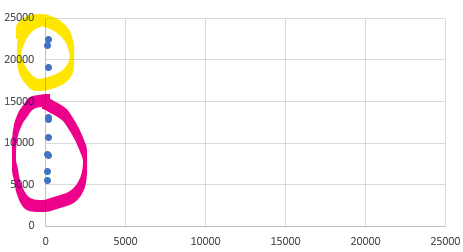
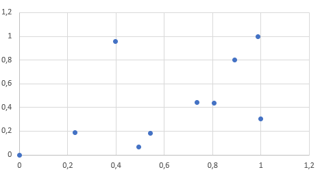
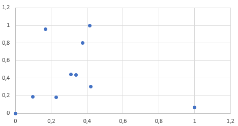

Normalizasyon başlığı kafanızda veritabanlarından aşina olduğunuz 1NF, 2NF gibi nitelediğimiz tasarımsal konuları olarak canlanmış olabilir. Bu konuda daha farklı konudan bir istatistik yöntemi olan normalleştirmeden bahsediyor olacağım.

Konuyla ilgili farklı isimlendirmeler görebilirsiniz. Bunlar, _özellik ölçekleme (feature scaling), normalleştirme/ normalize etmek / olağanlaştırma (normalisation)_, _standardize etme (standardisation)_ şeklinde karşımıza çıkmaktadır. Her biri farklı işlemleri anlatıyor olsa da pratikte hepsinin amacı aynıdır. Çok katı değilseniz hepsine normalleştirme demenizde de bir beis yok. ML.net'de zaten hepsini tek bir sınıf altında toplamış.

Normalleştirmeye ihtiyaç duymamızdaki en büyük sebep farklı niteliklerin farklı ölçü birimleri ile ölçülmesinden kaynaklanmaktadır. Eğer iki ölçü birimi arasında dönüştürme yapabiliyorsak bu çoğu zaman yeterli olacaktır. Farklı iki veri setinin birinde ağırlık bilgisi _kg_ diğerinde _lbs_ ile ölçülmüş olabilir. Bu durumda dönüşüm yapmak yeterlidir. Fakat farklı nitelikler için birbirilerine dönüştürülmeyecek birimler kullanıyoruz. Bir kişinin ağırlığını  _kg_, boyunu _cm_, maaşını _TL_ ile ölçüyoruz. Değer aralıkları çok farklı olan ölçüm değerlerinden bahsettiğimiz için klasik "elma-armut" çıkmazından dolayı bunları birbirileri ile işleme tabi tutamayız. Makine öğrenmesinde parametrik olmayan yöntemlerin çoğu uzaklık tabanlı çalışmaktadır. Yani karar verirken iki niteliğin düzlemde birbirine göre olan uzaklıklığına göre karar vermektedirler. 

Hemen bir örnek ile başlayalım; insan boylarını içeren geniş bir veri kümemiz olsun. Bu verilerde en kısa boy 100cm, en uzun ise 220cm olsun. Bu ölçümlerin her birini 0 ile 1 arasında ifade etmek amacıyla yola çıktığımızda, öncelikle en düşük değeri 0 a çekmek isteriz. Benzer şekilde de en yüksek boyda olanın da 1 olmasını isteriz. Neden böyle ifade etmek istediğimize ise sonra değineceğiz. Sadece en yüksek boya göre oranlasak tüm değerleri en yüksek boyun değerine bölmemiz yeterli olacaktır. En yüksek boya sahip örneğimiz 220cm idi bu durumda 220/220 = 1 elde ederiz ve tüm değerleri böyle oranlayabiliriz. Fakat bu durumda en kısa boy için 100/220 = 0.45 değerini elde ederiz. Bu işlem normalleştirme için yeterlidir ama biz en küçük değer 0 olsun en yüksek değer 1 olsun istediğimiz için hesap kitaba devam ediyoruz. Yeni amacımız, en kısa boyu 0 yapmak oldu. Bu amacı sağlamak için tüm ölçümlerden en düşük değeri yani 100'ü çıkartırsak en küçük değer için 0 elde ederiz. Yeni en yüksek değer ise 220 - 100 = 120 olacaktır. Bu durumda  `(n - 100) / 120` formülü serideki tüm sayılar için isteğimizi karşılayacaktır. Fakat bunu tek bir nitelik için yapmış olduk. 

Farklı nitelikler devreye girince anlatımı biraz görselleştirmekte fayda var, aşağıdaki veriyi inceleyin.

| Boy | Maas  |
|----:|------:|
| 121 | 8630  |
| 163 | 13030 |
| 102 | 5460  |
| 176 | 19090 |
| 169 | 12890 |
| 135 | 21790 |
| 184 | 22480 |
| 147 | 8520  |
| 185 | 10660 |
| 143 | 6610  |

Tabloya göre sadece Boy ve Maas kolonlarını düzlem üzerine yerleştirirsek ve düzlemdeki dağılımlarına göre 2 gruba ayırmaya karar versek aşağıdaki gibi bir görünüm elde ederiz.




Bu düzlemde Y ekseni _maaş_ı, X ekseni ise _boy_ u temsil etmektedir. Uzaklık olarak baktığımızda _boy_ bilgisinin hiç bir önemi kalmamıştır. Bizim gözle ayırmamıza benzer şekilde, kullanacağımız uzaklık tabanlı algoritmada çok benzer karar verektir.

Elimizdeki verileri normalize edelim ve tabloyu inceleyelim.

| Boy         | Maas        |
|------------:|------------:|
| 0,228915663 | 0,186251469 |
| 0,734939759 | 0,444770858 |
| 0           | 0           |
| 0,891566265 | 0,800822562 |
| 0,807228916 | 0,436545241 |
| 0,397590361 | 0,959459459 |
| 0,987951807 | 1           |
| 0,542168675 | 0,179788484 |
| 1           | 0,305522914 |
| 0,493975904 | 0,067567568 |

Normalize etitğimiz veriye göre aynı grafiği çıkarttığımızda alacağımız sonuç:


Bu grafikte ise dağılım çok daha güzel olmuştur. Her iki nitelikte aynı dereceden öneme sahiptir. Dolayısıyla yapılacak bir öğrenme muhtemelen daha doğru olacaktır.

> Normalleştirme işlemi aynı zamanda verinin görselleştirilmesini kolaylaştırmaktadır. 

Fakat bir çok normalizasyon yöntemi mevcuttur.  Tahmin ettiğiniz gibi her birinin artıları ve eksileri var.  Yoksa yukarıdaki yöntemi her yerde uygulardık. Kullanılan yöntemlerden önce problemlerden bahsetmekte fayda görüyorum.  Böylece yukarıda örneklediğimiz mim-max yöntemi nerelerde çuvallıyor onu bilebileceğiz. Bu bilgi de verinin analiz edilmesi aşamasında daha doğru algoritmaları seçmemizi sağlayacaktır.

## Sapan Veri Problemi

Aykırı değerler bulunan bir veriden yapılacak normalizasyon işlemleri tek bir aykırı değer sebebiyle bile veriyi oldukça bozacaktır. Yukarıdaki tabloda yaptığım tek bir değişikliğin etkilerine görsel olarak bakalım:

| Boy  | Maas  | BoyNormal   | MaasNormal  |
| ---: | ----: | ----------: | ----------: |
| 121  | 8630  | 0,095959596 | 0,186251469 |
| 163  | 13030 | 0,308080808 | 0,444770858 |
| 102  | 5460  | 0           | 0           |
| 176  | 19090 | 0,373737374 | 0,800822562 |
| 169  | 12890 | 0,338383838 | 0,436545241 |
| 135  | 21790 | 0,166666667 | 0,959459459 |
| 184  | 22480 | 0,414141414 | 1           |
| 147  | 8520  | 0,227272727 | 0,179788484 |
| 185  | 10660 | 0,419191919 | 0,305522914 |
| 300  | 6610  | 1           | 0,067567568 |



Görsel her şeyi anlatıyor. Tüm veri tek bir değer yüzünden sol tarafa yapışmış halde duruyor. Bu sonuçtan yapılacak bir makine öğrenmesinin başarımı düşük olacaktır. 

>  Tabii ki burada yapılması gereken asıl iş bu verinin temizlenmesi ya da değiştirilmesi olacaktır. Buna [Veri Kalitesi](http://www.cihanyakar.com/1-ml-net-veri-kalitesi) yazımda değinmiştim.

## Dağılım Problemleri
Eğer doğal bir veri ile çalışıyorsak bunun normal dağılıma uymasını bekleriz. Örneğin, insan boyu için konuşuyorsak ortalama değerdeki kişi sayılarının daha çok, uç değerdeki kişilerin (çok kısa, çok uzun) daha az olmasını bekleriz. Bu gibi verilerle çalışırkende CDF uygulanmış normalleştirmelerin daha iyi sonuç vermesi beklenir. CDF'in ne olduğuna aşağıda değineceğim. Çünkü normalleştirilmiş veride ortalamaya yakın değerlerin arasındaki mesafe artarken ortalmadan uzak verilerde azalmıştır. Eğer çalıştığımız veri az veya doğal değilse bu sefer normalleştirilmiş veri öğrenmeyi kötü etkileyebilir.


## ML.NET

Farklı normalizasyon türleri bulunmaktadır. ML.Net içerisinde 0.11 sürümü itibariyle 5 farklı tür normalleştirme yöntemi bulunmaktadır. İlla ki ilerleyen sürümlerde farklı yöntemlerde eklenir diye düşünüyorum. Fakat elimizdeki yöntemlere şöyle bir bakalım:


### Min-Max

Değerler -1 ile 1 arasında dağıtılır. `FixZero` pasif ise 0-1 arasında aynen yukarıda formülize ettiğimiz şekilde çalışır. _Özellik ölçekleme (feature scaling)_ deniyorsa bu veya bundan üretilen sayının bir sabitle çarpımından bahsediliyordur.

$$ x' = \frac{x- {min}}{{min} - {max}} $$


### Mean Variance

Bu işlem litratürde "Standardisation" veya "Standard Score" olarak geçmektedir. Hızlıca formülüne bakalım:

$$ x' = \frac{x-\mu}{\sigma} $$

Bu işlemin ardından üretilen yeni dizinin varyansı 1'dir. Uzaklık tabanlı algoritmalarda genellikle başarımı arttırmaktadır. Ses veya görüntü işlemede sık kullanıldığı görülür. Eğer `fixZero` parametresi aktif değilse, dizi içerisinde ortalama değer bulunuyorsa 0 değerini alacaktır.

### Log Mean Variance

Standardizasyon değerlerinin logaritmik ölçekte hesaplanması ile elde edilmekte. 

### Binning
Bu konudan daha önce [ML.net Kova Metodu](http://www.cihanyakar.com/2-ml-net-kovametodu ) yazımda bahsetmiştim. Veriyi hem normalleştirmeye hem de düzleştirmeye yaramaktadır.

### Fix Zero Parametresi
Bu parametre `true` değerini aldığı zaman 0 değerleri normalleştirilmiş veride de 0 olacak şekilde korunur. Bu özellikle ayrık verinin (boş değerlerin bol olduğu dersek kimse kızmaz sanıyorum) normalizasyonu yapılacağı zaman aktif edilmesi gereken bir parametredir.  Örneğin Min-Max için bu işlem yapıldığında formül aşağıdaki gibi olacaktır:

$$ x' = \frac{x}{{max}} $$

### UseCDF Parametresi
Bu yöntemde standardize edilmiş değerler birikimli (kümülatif) dağılım fonksiyonuna sokulmaktadır. İlgili sayıya kadar olan ihtimaller toplanarak sonuç bulunmaktadır.  Eğer dizi içinde ortalama değer varsa 0.5 değerini alacaktır. Benzer şekilde ortalamaya yakın değerler de 0.5 etrafında gezinecektir.  ML.net içerisinde her bir eleman için uygulanan fonksiyon aşağıdaki gibidir:

```
public static TFloat Cdf(TFloat input, TFloat mean, TFloat stddev)
            {
		var x = (input - mean) / stddev; // buraya kadar standardize ile aynı!
                var x2 = x * x / 2;
                const TFloat a = (TFloat)0.147;
                var ax2 = a * x2;
                return (TFloat)(0.5 + 0.5 * Math.Sign(x) * Math.Sqrt(1 - Math.Exp(-x2 * (4 / Math.PI + ax2) / (1 + ax2))));
            }

```

Bu normalleştirme işlemlerinde ortalamaya yakın değerler daha çok ayrışırlarken ortalamadan uzaklaştıkça normalleştirilen değer arasındaki var daha az olacaktır. Örneğin, ortalama 5, en yüksek değer 10 olduğunda. 5 ile 6 nın arasındaki fark 0.11 iken 9 ile 10 arasındaki fark 0.05'dir.

Eğer verinizin dağılımında belirli alanlarda yoğunlaşma veya boşluklar varsa bu yöntem önerilmemektedir. 


## ML.net üzerinde uygulama

ML.net üzerinde ayrı ayrı tüm özellikler için normalleştirme yapabileceğimiz gibi özellikleri `concatenate` ile birleştirip normalleştirme işlemi yapılabilir. Aşağıdaki örnekte tek bir nitelik için farklı farklı yöntemler karşılaştırılmıştır.

> **DİKKAT** Bu örnek 0.11 sürümünde geliştirilmiştir. Daha aşağı veya yüksek sürümlerde çalışmayabilir.

```c#
class Kisi
{
    public float Boy { get; set; }
}
class Program
{
    static void Main()
    {
        var boylar = new double[] { -1, 0, 1000, 1005, 2000 };

        var kisiler = boylar.Select(x => new Kisi { Boy = (float)x });
        var context = new MLContext();

        var dataView = context.Data.LoadFromEnumerable(kisiler);

        var pipeline = context
                            .Transforms
                            .Normalize(
                             new NormalizingEstimator.BinningColumnOptions(inputColumnName: "Boy",
                                       outputColumnName: "Binning", fixZero: false),
                                       new NormalizingEstimator.BinningColumnOptions(inputColumnName: "Boy",
                                       outputColumnName: "BinningFZ", fixZero: true),
                              new NormalizingEstimator.LogMeanVarColumnOptions(inputColumnName: "Boy",
                                       outputColumnName: "LogMeanVarCDF"),
                                       new NormalizingEstimator.LogMeanVarColumnOptions(inputColumnName: "Boy",
                                       outputColumnName: "LogMeanVar", useCdf: false),
                               new NormalizingEstimator.MeanVarColumnOptions(inputColumnName: "Boy",
                                       outputColumnName: "MeanVarZF", fixZero: true),
                                        new NormalizingEstimator.MeanVarColumnOptions(inputColumnName: "Boy",
                                       outputColumnName: "MeanVarCDFZF", fixZero: true, useCdf: true),
                                       new NormalizingEstimator.MeanVarColumnOptions(inputColumnName: "Boy",
                                       outputColumnName: "MeanVar", fixZero: false),
                                new NormalizingEstimator.MinMaxColumnOptions(inputColumnName: "Boy",
                                       outputColumnName: "MinMax", fixZero: false),
                                       new NormalizingEstimator.MinMaxColumnOptions(inputColumnName: "Boy",
                                       outputColumnName: "MinMaxZF", fixZero: true)
                                      );


        var preview = pipeline.Fit(dataView).Transform(dataView).Preview(100);


        foreach (var column in preview.Schema)
        {

            Console.Write(column.Name.PadLeft(17));

        }
        Console.WriteLine();

        foreach (var row in preview.RowView)
        {
            for (int i = 0; i < preview.Schema.Count; i++)
            {
                Console.Write(((float)row.Values[i].Value).ToString().PadLeft(17));
            }
            Console.WriteLine();
        }

    }
 
```
Yukarıdaki kodun çıktısı ise aşağıdaki gibi olacaktır:

|               Boy|           Binning|         BinningFZ|     LogMeanVarCDF|        LogMeanVar|         MeanVarZF|      MeanVarCDFZF|           MeanVar|            MinMax|          MinMaxZF|
| ----------------: | ----------------: | ----------------: | ----------------: | ----------------: | ----------------: | ----------------: | ----------------: | ----------------: | ----------------: |
|                -1|                 0|             -0,25|                 0|          -25,0027|     -0,0009121092|         0,1421805|         -1,070758|                 0|           -0,0005|
|                 0|              0,25|                 0|                 0|         -21,93129|                 0|         0,1424811|         -1,069422|      0,0004997501|                 0|
|              1000|               0,5|              0,25|         0,2374111|          3049,477|         0,9121091|         0,6048856|         0,2660202|         0,5002499|               0,5|
|              1005|              0,75|               0,5|         0,2421692|          3064,834|         0,9166697|         0,6074543|         0,2726974|         0,5027487|            0,5025|
|              2000|                 1|              0,75|         0,9213333|          6120,885|          1,824218|         0,9453756|          1,601463|                 1|                 1|

### Özet

Normalleştirme bir çok sınıflandırıcı için başarımı arttırmaktadır ve hatta gereklidir diyebiliriz. Fakat seçilen normalleştirme metodu başarımı problemlerin çoğunda fazla etkilememektedir. Bu sebeple ML.net'de tüm nitelikleriniz için normalleştirme yapcaksanız aşağıdaki kodu iş hattınıza (pipeline) yazıp geçmeniz yeterli olacaktır:

```csharp
context.Transforms.Normalize(DefaultColumnNames.Features)
```

Bu işlem `features` niteliği için  `min-max` normalleştirmesi yapacaktır.

Bir ML.net yazısının daha sonuna geldik. Bir sonrakinde görüşmek üzere.
