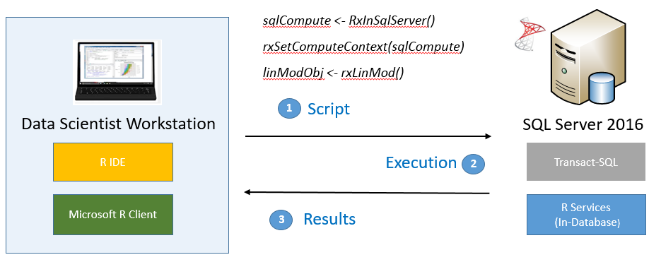

Microsoft ML.net ile tanışan arkadaşların bir kısmı bunu Microsoft'un bu konudaki ilk ürünü sanmaktalar. Bundan dolayı da neden bu kadar geç ürün çıkardığını merak ediyorlar. Aslında, Microsoft yıllara yayılmış olarak farklı farklı makine öğrenmesi ve yapay zekâ araç gereçleri geliştirmiştir. Bu yazıda her birine kısa özet geçmek istedim. Biraz ürün tanıtımı tadında gitmeye çalıştım. Daha sonra aralarında kendi kullandıklarıma daha detaylı ve negatif yönlerinden de bahsettiğim yazılar eklemek arzusundayım. 

## ML.net

Ml.net zaten blog içinde takip etmeye çalıştığım, uğruna seminerler verdiğim bir ürün olmaktadır kendisi. Bu ürünün öne çıkan özellikleri .net core sayesinde platform bağımsız olması ve açık kaynak olarak geliştirilmesidir. Ürün çok yeni ve bir çok eksiğini ek kütüphaneler ile kapatmakta. Kendisini Linux, Windows, MacOs, Android... gibi işletim sistemleri ile kullanmak mümkün. Masaüstü projeleri, web projeleri, mobil projeler (xamarin), oyun projeleri (unity) ve daha bir çok ortamda kullanılması mümkündür. Kendisine giriş yazımı blogun geçmişinde bulabilirsiniz. 

https://dotnet.microsoft.com/apps/machinelearning-ai/ml-dotnet

## Azure Machine Learning Studio

Azure Machine Learning Studio, oldukça kolay bir arayüz üzerinden "sürükle-bırak" mantığı ile kullanabileceğiniz, gerekirse Python, R gibi dillerle detaylara inebileceğiniz bir üründür kendisi. Geliştirdiğiniz modeller için kolayca Azure üzerinde endpointler oluşturup projelerinizde basit REST çağrıları ile kullanabiliyorsunuz. Daha önce KNIME, Deep Cognition, Lobe  gibi ürünleri denemişseniz her birinin özelliklerinin karması ile oluşturulmuş bir ürün olduğunu söyleyebilirim. Basit işlerle uğraşırken veya veriyi anlamaya çalışırken oldukça rahat edeceksiniz.

https://studio.azureml.net/

_Ünlü çiçek sınıflandırma/demetleme çalışmasının Azure ML Studio'da gerçekleştirilmesi_

## Azure Machine Learning Service

Azure Machine Learning Service, Visual Studio Code veya Jupyter defterleri üzerinde, istediğiniz Python kütüphanelerini kullanarak model oluşturmanızı veya hazır modellerden birini seçmenizin ardından bu modeli Azure üzerinde servis haline getirmenize yarayan bir ürün. Servisleri yerel olarak da kullanmanız mümkün. Ayrıca eğitim aşamasında CPU, GPU veya derin öğrenme için özelleştirilmiş FPGA'ları kullanmanız da mümkün. Üründe ONNX desteği olduğunu hatırlatırım. Bu da şu anlama geliyor. Buradan oluşturduğunuz modeli, ML.net kullanarak rahatlıkla çalıştırabilirsiniz.

Ürünün adresi:

<https://azure.microsoft.com/en-us/services/machine-learning-service/>

Ürünü hızlıca başlayabileceğini video:

<iframe width="560" height="315" src="https://www.youtube-nocookie.com/embed/GBDSBInvz08" frameborder="0" allow="accelerometer; autoplay; encrypted-media; gyroscope; picture-in-picture" allowfullscreen></iframe>

## Azure Data Bricks

Azure Data Bricks, [Apache Spark](https://spark.apache.org/) platformunun Azure üzerinde yer bulmuş hali diyebiliriz. Kurulumu, kullanımı oldukça rahat. Python,R,Scala ve T-SQL gibi destekli diller ile analitik çalışmalara makine öğrenmesi katmak mümkün olmakta. Azure üzerindeki Azure SQL Data Warehouse, Azure Cosmos DB, Azure Data Lake Storage, Azure Event Hubs, ve Azure Data Factory gibi bir çok ürünle entegre çalışmaktadır. Daha çok kurumların analitik çalışmalarını hedeflediği için, sanıyorum ben pek yakın olmayacağım kendisiyle...

https://azure.microsoft.com/en-us/services/databricks/

_Ürünü anlatan bir görsel_

## Azure Cognitive Services

Öğrenme verisi hazırlama, ön işleme, algoritma seçme, değerlendirme gibi işlerle dahi uğraşmak istemiyorsanız sizi buraya alalım.ACS, Makine öğrenmesi ile sık yapılan, görüntü tanıma, metin duygu analizi,anomali yaklama ve dikte gibi çok işlemi basit web servisleri ile sunan bir üründür. Çok nadir durumlarda elinizi Python'a bulamak gerekebileceğini belirtmekte fayda var, sonra "vay efendim" ile başlayan cümleler gelmesin. Uygulamanıza hızlı ve kolayca bir "akıl" katmak istiyorsanız şiddetle tavsiye ederim.

https://azure.microsoft.com/en-us/services/cognitive-services/

_Su böreği fotoğrafı ile yaptığım bir deneme, börek olduğunu bilmese de oldukça güzel sonuçlar aldığımı düşünüyorum_

## Azure Data Science Virtual Machine

Microsoft, Azure üzerinde bizim için hazır sanal makine imajları oluşturmuş. Bu makinelerin içerisinde yok yok. İhtiyaç duyacağınız tüm veri işleme araçları, python kütüphaneleri yüklenmiş durumda gelen bu makinelerden birini hazırda tutmak hoş olacaktır. Linux ve Windows sürümleri mevcut. Makine açık kaldığı sürece ücretlendirileceğinizi söylemekte fayda var. Visual Studio'nuz üzerinde AI Tools yüklü ise bu makineleri cluster olarak eklemeniz de mümkün.
https://azure.microsoft.com/en-us/services/virtual-machines/data-science-virtual-machines/

## Machine Learning Server

Machine Learning Server, sunucunuzda (windows,linux) çalışan ve her şeyi derli toplu bir araya getiren bir üründür. Python veya R ile oluşturduğunuz modellerinizi MSSQL üzerinde yordamlar (SP) haline çevirebilirsiniz veya REST servisleri olarak sunabilirsiniz. Kurulumda Microsoft R Open, Anaconda gibi araçlar ve hazır modeller gelmekte. Ben kendisini yeni tanıyorum, tanıdıkça daha sık bahsedeceğim gibi. 

https://docs.microsoft.com/en-us/machine-learning-server/what-is-machine-learning-server

_Dağıtım örneği_

## SQL Server Machine Learning Services

Bir önceki ürünün SQL Server bağımlı halinden bahsediyoruz. Eğer aynı sunucuda SQL Server da kullanılacak ise bu ürünü kurmanız öneriliyor. Her iki ürün de SQL Server kurulumu sırasında seçilerek kurulduğundan neyi seçtiğimize dikkat etmek gerekli. Sonrasında ise SQL komutları içerisinde Python ve R scriptleri çalıştırabilirsiniz.
https://docs.microsoft.com/en-us/sql/advanced-analytics/what-s-new-in-sql-server-machine-learning-services?view=sql-server-2017

_Örnek senaryo_

## Windows ML

Windows 10 ve Windows Server 2019 dahili bir ML kütüphanesi ile birlikte geliyor. Doğrudan herhangi bir programlama dili ile bu API'ya erişip çalışabilirsiniz. Kendisi ONNX modellerini destekliyor ve [WinMLTool](https://docs.microsoft.com/en-us/windows/ai/windows-ml/convert-model-winmltools) yardımıyla bir çok modeli ONNX biçimine dönüştürebiliyor. Ayrıca kendisinin Direct ML üzerinde çalıştığını da belirtmek isterim.
https://docs.microsoft.com/en-us/windows/ai/windows-ml/

_WinML katmanları_

## CNTK

C# biliyorsunuz ve derin nöral ağlar kurmak istiyorsanız işte bu arkadaş size yardımcı olacak :). Kendisi sadece C# ile çalışmıyor tabiki ama bizim açımızdan önemli kısım C# ile çalışması. Kendisine has BrainScript dili olsa da bizi ilgilendiren ONNX ve CUDA destekleri olacaktır. Oluşan modeller daha sonra dilenirse ML.net ve Windows ML içinde de kullanılabilir. Hızlıca GPU üzerinde bir şeyler yapayım diyorsanız tavsiyem kendisinden yana olacaktır.
https://docs.microsoft.com/en-us/cognitive-toolkit/using-cntk-with-csharp

## Direct ML

Ben aracıları, frameworkleri sevmiyorum diyorsanız üşenmeyip kendi makine öğrenmesi algoritmanızı geliştirecekseniz size oldukça yardımcı olacak bir kütüphaneden bahsediyoruz. Kendisi DirectX 12 içinde geliyor ve uyumlu grafik kartları ile çalışabiliyor. İçerisine baktığımızda diğer frameworklerdeki gibi hazır yapılar görmüyoruz. Sadece algoritma geliştirirken gerekli olacak matematik işlemlerini sağlıyor. Yani aslında aynı kodu yazıyoruz fakat bu kod CPU değil de GPU üzerinde çalışıyor. DirectX çatısı altında birleştiği içinde ekran kartı üreticisine göre spesifik kod yazmamış oluyorsunuz.  
