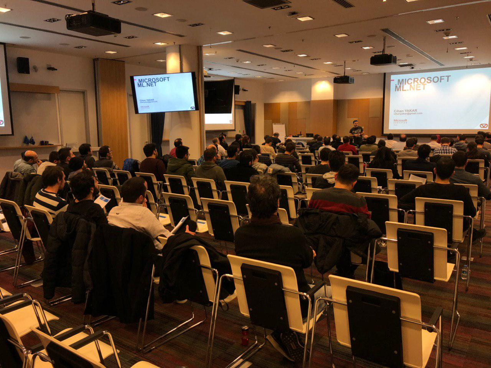

**Teknolot** olarak gerçekleştirdiğimiz son etkinliğimiz epey geç duyurmamıza güzel bir katılım aldı. Etkinlikde Daron baştan sona bir Serverless SPA örneği gerçekleştirdi. Ben de ML.net anlattım. Katılan, geç saate kadar bizi sıkılmadan dinleyen herkese çok teşekkürler.

Sunumdaki örnek kodlar:

[https://github.com/Teknolot/meetup-demos/tree/master/ml-net-wine-classification](https://github.com/Teknolot/meetup-demos/tree/master/ml-net-wine-classification)

