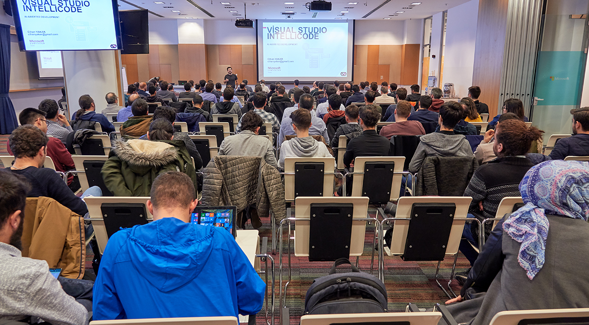

Visual Studio Launch etkinliğinin Türkiye ayağını gerçekleştirdik. Benim iki oturumum bulunan etkinlik oldukça eğlenceli geçti. Katılan herkese ve Microsoft Türkiye'ye çok teşekkürler. Etkinlikte benim "IntelliCode" ve "ML.net ile Segmentasyon" adlı iki adet konum bulunuyordu. Bunlara ilişkin sunumları aşağıda bulabilirsiniz.

