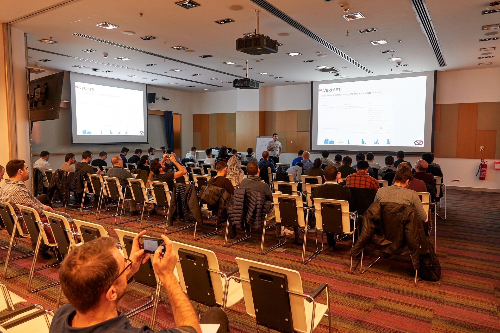

Xamarin Türkiye'nin 3.Yıl etkinliğinde Yiğit Özaksüt ve Daron Yöndem ile birlikte konuştuk. Eğlenceli geçen etkinlikte benim sürprizli konum Xamarin ile ML.net uygulaması oldu. Uygulamada ev fiyat tahmini üzerine bir regresyon problemini ml.net çözüp, oluşan modeli Xamarin'e aktardık.

Sunumdaki örnek kodlar:

[https://github.com/Teknolot/meetup-demos/tree/master/xamarin-mlnet-regression](https://github.com/Teknolot/meetup-demos/tree/master/xamarin-mlnet-regression)

